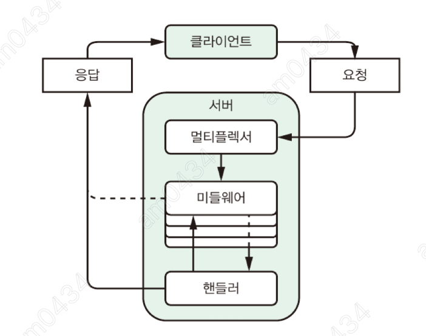

# ch-09 HTTP 서비스 작성
- 요청을 처리하고 클라이언트에게 리소스를 보낼 수 있는 서버를 작성한다. net/http 패키지가 대부분의 세부사항을 처리해 주므로 서버를 초기화하고 설정하고, 리소스를 생성하고, 클라이언트가 보내는 요청을 처리하는 데에 집중할 수 있다.
- Go에서 HTTP서버는 서로 활발하게 통신하는 여러 요소에 의존한다. 여려 요소란 핸들러와 미들웨어, 그리고 멀티플렉서를 의미한다. 웹 서비스란 이 모든 요소를 포함하는 서버이다. 이번 장에서는 먼저 간단한 HTTP 웹 서비스를 살펴본 후 각 요소들에 대해 알아보겠다. 또한, net/http 패키지를 사용하여 TLS를 지원하거나 HTTP/2 클라이언트에 데이터를 푸시하는 동의 고급 사용법에 대해 알아본다. 이번 장의 내용을 잘 숙지하면 Go 기반의 HTTP 서버를 설정하고 미들웨어를 작성하고 핸들러를 사용하여 사용자의 요청에 응답하는 것에 익숙해질 것이다.

## Go HTTP 서버 해부
- 아래 그림은 일반적인 net/http 기반의 서버가 요청을 처리하는 과정을 보여준다.

1. 먼저 서버의 멀티플렉서(컴퓨터 네트워킹 용어로는 라우터router)는 클라이언트의 요청을 수신한다. 
2. 멀티플렉서는 요청의 목적지를 결정한 후 해당 요청을 처리할 수 있는 능력이 있는 객체로 클라이언트의 요청을 전달한다. 이 객체를 핸들러(handler)라 부른다. 멀티플렉서 또한 클라이언트의 요청을 받아 적절한 핸들러로 넘겨주는 하나의 핸들러이다.
3. 핸들러가 요청을 넘겨받기 전, 멀티플렉서는 먼저 요청을 미들웨어라 불리는 하나 이상의 함수로 전달한다. 미들웨어는 핸들러의 동작을 변경하거나 로깅, 인증 및 접근 제어 등의 부가적인 작업을 수행한다.
- [/server] 예제에는 HTTP 서버와 멀티플렉서를 초기화하는 코드, 그리고 [/client]에는 앞의 서버로 요청을 보내는 클라이언트 코드가 있다.

### 클라이언트는 서버의 시간을 신경쓰지 않음
- 클라이언트의 타임아웃 값 뿐 아니라 서버의 다양한 타임아웃 값들도 관리해 주어야 한다. 클라이언트는 서버의 시간을 신경쓰지 않기 때문이다. 클라이언트는 그저 서버로 요청을 보내며 응답이 오기를 기다리고 있을 뿐이다. 반면, 서버는 서버 내의 컴퓨팅 자원이나 메모리 등의 리소스를 사용하여 요청 전체를 수신할 때까지 대기한다. 또한 서버는 클라이언트가 응답을 다 받을 때까지 기다려야 한다. 서버가 전송할 수 있는 최대 속도는 클라이언트가 읽을 수 있는 최대 속도만큼이기 때문이다. 따라서 클라이언트가 요청-응답 생명주기를 지정하지 않도록 해야 된다.
- [/server] 예제의 http.Server 인스턴스의 타임아웃과 관련된 두개의 값을 설정했다. IdleTimeout은 클라이언트가 요청 간 유휴 상태로 존재할 수 있는 시간이고, ReadHeaderTimeout은 요청 헤더를 읽는 동안 서버의 대기 시간이다. http.Server 내에 사용할 수 있는 타임아웃과 관련된 필드가 여러 개 존재하지만 위의 두개만 사용하기를 권장한다. 이 두 필드가 지정하는 대기 시간은 실제로 요청 보디를 읽는 데 걸리는 시간과는 무관하다. ReadTimeout, WriteTimeout의 값을 작게 주면 클라이언트가 요청 보디에 큰 파일을 전송하는 핸들러, 혹은 클라이언트에게 지속해서 데이터를 스트리밍해야 하는 핸들러에게는 문제가 된다. 

### TLS 지원하기
- 기본적으로 HTTP 트래픽은 플레인텍스트이지만, 웹 클라이언트와 서버는 암호화된 TLS연결을 이용하여 HTTP를 사용할 수 있다. 이러한 조합을 HTTPS라 부른다. Go의 HTTP 서버에서 HTTP/2 지원은 반드시 TLS 연결을 통해서 가능하지만, TLS를 활성화하는 것은 간단하다. [/server]의 구현에서 포트번호와 Server 메서드, 두 라인만 수정하면 된다.
```
srv := &http.Server{
		Addr: "127.0.0.1:8443",
		Handler: http.TimeoutHandler(
			handlers.DefaultHandler(), 2*time.Minute, ""),
		IdleTimeout:       5 * time.Minute,
		ReadHeaderTimeout: time.Minute,
	}

	l, err := net.Listen("tcp", srv.Addr)
	if err != nil {
		fmt.Println(err)
		return
	}
	go func() {
		err := srv.ServeTLS(l,"cert.pem","key.pem")
		if err != http.ErrServerClosed {
			fmt.Println(err)
		}
	}()
```
- 포트번호를 변경할 필요는 없지만 통상적으로 HTTPS는 443번 포트, 혹은 443에 어떤 숫자를 추가한 형태를 사용한다. 서버의 ServeTLS 메서드를 사용하여 TLS상에서 HTTP를 사용하도록 한다. ServeTLS메서드의 매개변수로 인승서와 개인키의 경로를 지정한다. mkcert 프로젝트(https://github.com/FiloSottile/mkcert/)를 이용하면 개발용으로 사용할 수 있는, 로컬 내에서 신뢰성 있는 키 페어를 생성할 수 있다. 프로덕션 시스템에서는 Let's Encrypt를 사용하여 키페어 얻는 것을 고려해야 한다.

### 핸들러[/handler]
- 클라이언트가 HTTP 서버로 요청을 보내면 서버는 먼저 그 요청으로 무엇을 할지 파악해야 한다. 서버는 클라이언트의 요청에 따라 다양한 리소스를 받아와야 할 수도 있고, 혹은 어떠한 동작을 수행해야 할 수도 있다. 이러한 문제를 해결하기 위한 일반적인 디자인 패턴은 핸들러라 부르는, 요청을 처리할 수 있는 코드로 작성하는 것이다. 앞선 '멀티플렉서'를 통해서 서버는 요청에 대한 핸들러를 선택하는 방법을 알아볼 것이다.
- Go에서 핸들러는 http.Handler 인터페이스를 구현한 객체이다. 핸들러는 클라이언트의 요청을 읽고 응답을 쓴다. http.Handler 인터페이스는 요청과 응답 모두 매개변수로 받는 하나의 메서드로 구성된다.


### httptest를 이용하여 핸들러 테스트하기
- Go의 표준 라이브러리에는 net/http/httptest 패키지가 존재한다. 이 패키지를 이용하여 손쉽게 핸들러의 유닛 테스트를 할 수 있다. NewRequest 함수의 매개변수로 HTTP 메서드, 대상 리소스, 그리고 요청 보디의 io.Reader를 전달한다. 그러면 http.Handler에서 사용할 수 있는 http.Request 객체의 포인터가 반환된다.
```
fun NewRequest(method, target string, body io.Reader) *http.Request
```
- http.NewRequest 함수와는 다리게 httptest.NewRequest 함수는 문제가 생기면 에러를 반환하는 대신 패닉한다. 테스트환경이기 때문에 패닉한다.
- httptest.NewRecorder 함수는 http.ResponseWriter 인터페이슬ㄹ 구현한 httptest.ResponseRecorder 객체의 포인터를 반환한다. http.ResponseRecorder 객체에서 사용할 수 있는 일부 필드는 사용하고 싶게 생겼습니다만, 필드를 직접 사용하지말고 Result 메서드를 사용하기를 권장한다. Result 메서드는 다른 장에서 사용했던 것과 같이 http.Response 객체의 포인터를 반환한다. Result 메서드는 이름과 같이 핸들러가 처리되고 
httptest.ResponseRecorder의 결과를 받아 올 때가지 기다린 후에 결과값을 반환한다.
- [/handlers/pitfall_test.go] 에서는 httptest.NewRequest 함수와 httptest.NewRecorder 함수를 사용한다.
- 한 가지 실수할 수 있는 것은 응답 보디를 쓰는 순서와 응답 상태 코드를 올바르게 설정하는 것이 굉장히 중요하다는 것이다. 클라이언트는 서버로부터 먼저 상태 코드를 받은 후에 응답 보디를 받는다. 만약 응답 보디를 먼저 쓰면 Go는 응답 상태 코드를 200이라고 생각하고 실제로 응답 보디를 보내기 전에 클라이언트에게 먼저 보낸다. 이 동작을 알아보기위해서 [/handlers/pitfall_test.go] 예제를 보자.

### 모든 타입은 핸들러가 될 수 있다.
- http.Handler가 인터페이스이기 때문에 이를 이용하여 클라이언트의 요청을 처리할 수 있는 강력한 구조를 작성할 수 있다. [/handlers/methods.go] 예제에서는 http.Handler 인터페이스를 구현한 새로운 타입을 정의하여 기본 핸들러를 개선한다. 이 새로운 타입은 특정한 HTTP 메서드 요청에 대해 올바르게 응답할 수 있고, 자동으로 OPTIONS 메서드를 구현해준다.
- [/handlers/methods.go]예제의 Methods 타입에는 ServeHTTP() 메서드가 구현되어있어서 http.Handler 인터페이슬르 구현한다. 따라서 Methods타입은 클라이언트의 요청에 대해서 응답할 수 있다.
```
type Handler interface {
    ServeHTTP(ResponseWriter, *Request)
}
```

### 핸들러에 의존성 주입
- http.Handler 인터페이스를 사용하면 요청과 응답 객체에 접근할 수 있다. 하지만 실제로 사용자의 요청을 처리하기 위해서 로거logger나 메트릭스, 캐시, 혹은 데이터베이스와 같은 추가적인 기능에 접근하는 것이 필요할 수 있다. 예를 들어, 요청에서 발생하는 에러를 기록하기 위해 로거를 주입하거나, 응답에서 사용할 데이터를 생성하기 위해 데이터베이스에 접근할 수 있는 객체를 주입할 필요가 있을 수 있다. 객체를 핸들러로 주입하기 위한 가장 쉬운 방법은 클로저closure를 이용하는 것이다.

### 미들웨어
- 미들웨어는 http.Handler를 매개변수로 받아서 http.Handler를 반환하는, 재사용할 수 있는 함수로 구성된다. 메들웨어를 사용하여 요청을 자세히 살펴보거나, 요청의 내용을 기반으로 다음의 핸들러에게 요청을 전달하기 이전에 결정을 내릴 수도 있습니다. 또는 요청의 내용을 기반으로 응답의 헤더를 미리 설정할 수도 있다. 예를 들어, 미들웨어를 이용하여 인증을 필요로 하는 핸들러에대해 인증되지 않은 사용자가 요청을 보낼 경우 에러를 반환할 수도 있다. 미들웨어를 이용하면 메트릭스를 수집하거나 요청을 로깅할 수 있으며, 리소스의 접근을 제어할 수도 있다. 무엇보다 여러 핸들러에서 미들웨어를 재사용할 수 있다.
- 여러 핸들러에서 동일한 로직을 계속해서 작성해야 한다면 해당 기능을 미들웨어로 작성한 후에 여러 핸들러에서 작성한 미들웨어를 재사용하는 것이 옳을 것이다.
- 아래 예시는 핸들러가 처리할 수 있는 메서드 종류를 강제하거나, 응답의 헤더를 추가하거나, 혹은 로깅과 같은 부가적인 기능을 처리하는 등 미들웨어가 할 수 있는 기능을 모아놓았다.
```
func Middleware(next http.Handler) http.Handler {
    return http.HandlerFunc(  // 1
        func(w http.ResponseWriter, r *http.Request) {  // 2
            if r.Method == http.MethodTrace {
                http.Error(w, "Methods not allowed", http.StatusMethodNotAllowed) // 3
            }
            w.Header().Set("X-Content-Type-Options","nosniff")  // 4

            start := time.Now()
            next.ServeHTTP(w,r)  // 5
            log.Printf("Next handler duration %v", time.Now().Sub(start))  // 6
        },
    )
}
```
1. 1~2 - http.ResponseWriter 인터페이스와 http.Request 포인터를 매개변수로 받은 후 이를 http.HandleFunc에서 감싼다.
2. 5 - 대부분의 경우 미들웨어는 주어진 핸들러를 호출한다.
3. 3 - 어떤 경우에는 미들웨어 자체에서 다음 핸들러를 호출하지 않고 미들웨어에서 클라이언트에게 응답한다.
4. 4 - 마찬가지로 미들웨어를 사용해서 메트릭스를 수직하거나, 응답에 특정한 헤더를 설정한다.
5. 6 - 또는 로그 파일을 쓴다.

- 위의 예시는 인위적인 예시이다. 실제로는 하나의 미들웨어 함수에서 많은 일들을 처리하는 일은 없다. 이상적으로 위의 예시는 세 개의 미들웨어 함수로 나눌 수 있다. 각각 요청 메서드를 확인하여 클라이언트에게 응답하는 미들웨어(3), 응답 헤더를 설정하는 미들웨어(4), 그리고 메트릭스를 수집하는 미들웨어(6)가 될 것이다.
- net/http 패키지에는 정적 파일을 서빙하거나 요청을 리다이렉트하고 요청의 타임아웃을 관리하는 유용한 미들웨어들이 존재한다. 

### 느린 클라이언트 타임아웃하기
- 클라이언트가 요청-응답 생명주기 시간을 정하게 해서는 안된다. 악의적인 클라이언트가 서버의 리소스를 전부 잡아먹데 되어 실제 클라이언트들이 서비스를 사용할 수 없게 된다. 하지만 서버의 전체 설정으로 읽기와 쓰기의 타임아웃을 설정하면 서버가 데이터를 스트리밍하거나 각각의 핸들러에 대해 다른 타임아웃을 적용하기가 어려워진다. 그래서 미들웨어, 혹은 각각의 핸들러에서 타임아웃을 관리해야 된다. net/http 패키지에는 핸들러마다 요청이나 응답에 걸리는 기간을 제어할 수 있다. http.TimeoutHandler 함수는 http.Handler와 대기시간, 그리고 응답 보디에 쓸 문자열을 매개변수로 받은 후 주어진 대기시간으로 내부적으로 동작하는 타이머를 설정한다. 타이머가 만료되기 전까지 http.Handler가 반환되지 않으며 http.TimeoutHandler 함수는 http.Handler 함수로 블로킹하고 클라이언트에게 503 Service Unavailable 상태를 응답한다.
- [middleware/timeout_test.go] 에서는 느린 클라이언트를 흉내내는 http.Handler를 래핑한다. 해당 예제는 클라이언트에게 응답을 읽을 수 있는 유한한 시간을 준다.

### 민감한 파일에 대한 보안
- 미들웨어를 사용하면 클라이언트에게 노출하면 안 되는 정보를 보호할 수 있다. 예를 들어, 손쉽게 클라이언트에게 정적 파일을 서빙할 수 있는 http.FileServer 함수는 http.FileSystem 인터페이스를 매개변수로 받고 http.Handler 인터페이스를 반환한다. 하지만 시스템 파일이나 설정 파일 등, 노출되어서는 안 되는 민감한 파일들이 보호되지 않고 그대로 노출된다는 문제가 존재한다. 서빙할 파일이 있는 대상 디렉터리 내에 있는 파일 모두가 노출되어 버린다. 일반적으로 대부분의 운영체제는 민감한 파일이나 디렉터리 경로명으로 온점(.)을 접두사로 사용하여 운영체제 내부의 설정 파일이나 그 외의 기밀 정보를 포함하는 파일 및 디렉터리를 저장한다. 하지만 http.FileServer 함수가 반환하는 핸들러는 온점으로 시작하는 파일이나 디렉터리를 아무런 제재 없이 서빙하곤 한다.
- net/http 패키지의 문서에는 http.FileServer 함수를 사용한 파일 서버가 http.FileSystem으로부터 온점을 접두사로 갖는 파일이나 디렉터리를 서빙하지 못하게 하는 예시 코드가 존재한다. [/middleware/restrict_prefix.go] 에는 미들웨어를 사용하여 동일한 동작을 다른 접근 방법으로 해결한다.

## 멀티플렉서
- 멀티플렉서(multiplexer)란 클라이언트의 요청을 특정한 핸들러로 라우팅해주는 범용 핸들러이다. http.SErveMux 멀티플렉서는 클라이언트의 요청을 요청된 리소스에 알맞은 핸들러로 라우팅해 주는 http.Handler 인터페이스이다. 기본적으로 http.ServeMux는 모든 요청에 대해 404 Not Found로 응답한다. 