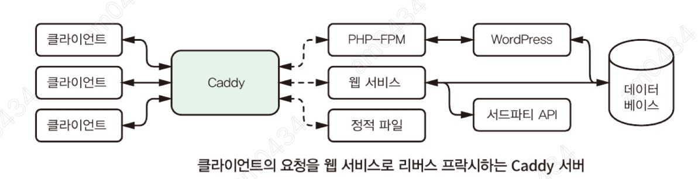

# chapter 10 - Caddy : 모던 웹 서버
- Caddy 웹 서버에 대해서 살펴보고, 이를 이용하여 웹 서비스를 작성하고 애플리케이션에 활용하는 법을 알아본다. 
- Caddy를 사용하는 방법을 알아보고 실시간으로 구성 설정을 변경할 수 있는 API를 알아본다.
- 커스텀 모듈과 다양한 구성 설정 어댑터를 활용하여 Caddy의 기능을 확장하는 방법에 대해서 알아본다. 이를 이용하면 Caddy를 사용하여 애플리케이션의 정적 파일을 서빙하고 
웹 서비스로 요청을 프락시할 수 있다.
- Let's Encrypt 로부터 무료 인증서를 얻어 오는 Caddy의 자동 TLS 지원 기능과 자동으로 인증서와 키를 관리해주는 기능에 대해 알아본다.

- 이번 챕터 이후에는 웹 애플리케이션을 구성할 때 간단하게 net/http 기반의 웹 서버만 사용하여 구성하는 것이 좋을지, 아니면 caddy와 같이 포괄적인 솔루션을 사용하여 구성하는 것이
좋을지 등 최선의 솔루션을 선택하는 데 큰 도움이 될 것이다.

## Caddy란?
Caddy는 보안과 성능, 그리고 사용성을 중시하는 현대의 웹 서버이다. 주요 기능 중 하나로서, 자동으로 TLS 인증서를 관리해 주어 손쉽게 HTTPS를 구성할 수 있도록 해 준다. Caddy는 Go의
동시성 및 병렬성의 강점을 취하여 상당량의 웹 트래픽을 서빙할 수 있다. 엔터프라이즈 레벨의 지원을 해 주는 몇 안 되는 오픝소스 프로젝트 중 하나이다.

### Let's Encrypt 통합
Let's Encrypt는 HTTPS 통신을 위해 디지털 인증서를 공개적으로 무료로 제공해 주는 비영리의 인증서 관리 단체이다. 거의 모든 웹 브라우저는 Let's Encrypt의 인증서를 신뢰한다.
ACME(Automated Certificate Management Environment) 자동화된 인증서 관리 환경이라 부르는 Let's Encrypt의 자동화된 인증서 발급 빛 갱신의 프로토콜을 사용하여 웹 사이트의 인증서를 얻어 올 수 있다.

일반적으로 인증서를 얻어 오는 작업은 세 단계로 이루어진다. 인증서를 요청하고, 도메인을 검증한 뒤, 인증서를 발급받는다. 발급된 인증서는 최대 90인간 사용할 수 있으며,
서비스가 중단되지 않기 위해서 60일마다 갱신해야 된다.

Caddy는 기본적으로 ACME 프로토콜을 지원하며, 자동으로 인증설르 요청하고 검증한 뒤에 실제로 Caddy가 해당 도메인을 현재 서버 내에서 호스팅하고 있는 경우 Let's Encrypt에서 발급받은 인증서를 설치해 준다.
이후에 '자동 HTTPS 기능 추가하기'에서 살펴보겠다. Caddy는 자동으로 인증서를 갱신해 주어 인증서의 만료 기간을 확인할 필요가 아예 없다.

### Caddy를 웹 서비스에 활용하는 방법

Caddy는 NGINX나 Apache와 같이 유명한 웹 서버와 유사하게 동작한다. 위의 그림처럼 웹 클라이언트와 웹 서비스 사이의 네트워크 최전방에 위치한다.
Caddy는 정적 파일을 서빙하고 클라이언트와 백엔드 서비스 간에 리버스 프락시라 부르는 절차를 통해 요청을 전달한다. 위의 예시에서 Caddy는 PHP-FPM(PHP의 FastCGI 프로세스 매니저)와 정적파일, 그리고 Go 기반 웹 서비스를 통해 워드프레스 블로그를 서빙한다. 이번 챕터 후반부에 워드프레스 블로그 외의 서비스에 대해 비슷한 환경을 구성해 볼 것이다.
Caddy를 사용하면 마치 코드상의 추상화처럼 클라이언트로부터 웹 서비스를 추상화시킬 수 있다. Caddy의 자동화된 TLS 기능과 정적 파일 서버, 데이터 압축, 접근 제어 및 로깅 기능을 사용하면 구현해야 할 웹 서비스 내에 이러한 기능을 직접 개발하지 않아도 된다. 게다가 Caddy를 사용하면 여러 네트워크 구성을 추상화시키어 클라이언트에게는 단순하게 Caddy만을 바라보도록 할 수 있다는 장점이 있다. 사용자가 늘어남에 따라 하나의 웹 서비스로는 처리가 어려워지게 되면, 추가로 노드를 늘리고 Caddy에 등록하여 클라이언트가 요청이 중단되지 않고도 여러 노드로 부하를 분산시킬 수 있다.

## Caddy 사용해보기
사용할 버전은 Caddy 2이다.

### Caddy 다운로드
https://caddyserver.com/ 다운로드 링크에서 바이너리를 다운로드 할 수 있다.

## Caddy 환경구성 및 실행하기d
- Caddy에서는 환경구성의 목적으로 관리자가 TCP 포트 2019번에서 접근할 수 있는 엔드포인트가 있다. 이 엔드포인트에 환경구성 정보의 JSON 데이터와 함께 POST요청을 전송하여 Caddy의 환경구성을 변경할 수 있으며, GET 요청을 전송하여 환경구성 정보를 읽어올 수 있다. 
```
$ caddy start
025/01/06 07:26:50.563	INFO	admin	admin endpoint started	{"address": "localhost:2019", "enforce_origin": false, "origins": ["//localhost:2019", "//[::1]:2019", "//127.0.0.1:2019"]}
2025/01/06 07:26:50.563	INFO	serving initial configuration
Successfully started Caddy (pid=11758) - Caddy is running in the background

```
- postman을 사용해서 localhost:2019/load 요청을 method POST로 아래 JSON 데이터와 함께 보냈다
```
{
    "apps":{
        "http":{
            "servers":{
                "hello":{
                    "listen":["localhost:2020"],
                    "routes":[{
                        "handle":[{
                            "handler":"static_response",
                            "body":"Hello, world!"
                        }]
                    }]
                }
            }
        }
    }
}

```
- 위의 요청은 2020번 포트의 loclahost에서 리스닝하는 hello라는 이름의 서버를 하나 구성한다. 서버 이름은 원하는 대로 지으면 된다. listen 필드의 값이 주소의 배열이기 때문에 한 서버에서 하나 이상의 소켓 주소가 리스닝하도록 구성할 수 있다. 또한, 단일 포트 외에도 localhost:2020-2025와 같이 범위를 지정하여 전달하더라도 Caddy가 이를 인식하여 각각의 소켓 주소로 파싱한다.
- hello 서버의 라우트 값("routes")은 이전 장의 멀티플렉서와 같이 라우트의 배열이며, 이는 서버가 요청을 처리하기 위한 방법을 나타낸다. 사용자의 요청이 처리할 라우트와 일치하면 Caddy는 handle 배열에 있는 각 핸들러로 요청을 전달한다. handle 필드의 값으로 배열을 받기 때문에 라우트마다 하나 이상의 핸들러를 지정할 수 있다. 이 예시에서는 모든 요청과 일치하는 하나의 라우트를 지정하고, 라우트에 대해 하나의 핸들러를 추가했다. 기본 내장된 static_response 핸들러를 사용하여 응답 보디에 Hello, world!를 쓰도록 했다. \
```
$ lsof -Pi :2019-2020
COMMAND   PID   USER   FD   TYPE DEVICE SIZE/OFF NODE NAME
caddy   11758 sodami    8u  IPv4  86507      0t0  TCP localhost:2019 (LISTEN)
caddy   11758 sodami    9u  IPv4  86508      0t0  TCP localhost:2020 (LISTEN)
$ 
```

-위와 같은 설정후 Caddy의 관리자 엔드포인트에 GET 요청을 보내서 환경구성 정보를 확인할 수 있다.
```
GET : localhost:2019/config/

{
    "apps": {
        "http": {
            "servers": {
                "hello": {
                    "listen": [
                        "localhost:2020"
                    ],
                    "routes": [
                        {
                            "handle": [
                                {
                                    "body": "Hello, world!",
                                    "handler": "static_response"
                                }
                            ]
                        }
                    ]
                }
            }
        }
    }
}
```

- 새로 설정한 포트로 요청을 보내보겠다.
```
$ curl localhost:2020
Hello, world!

```

### 실시간으로 Caddy의 환경구성 수정하기
